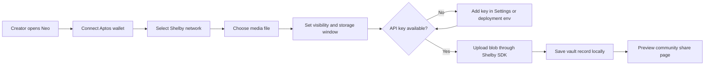
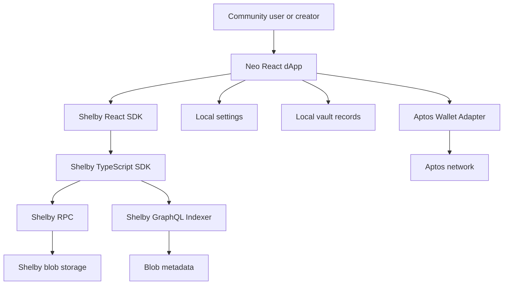
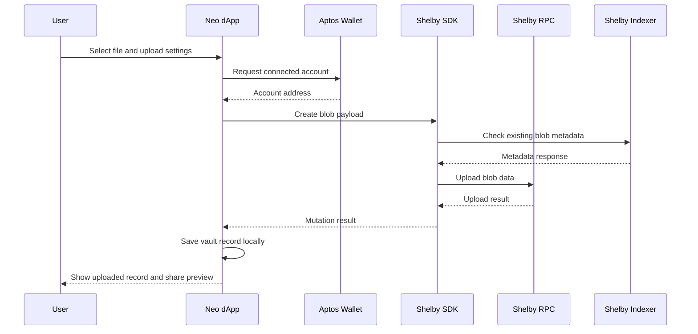
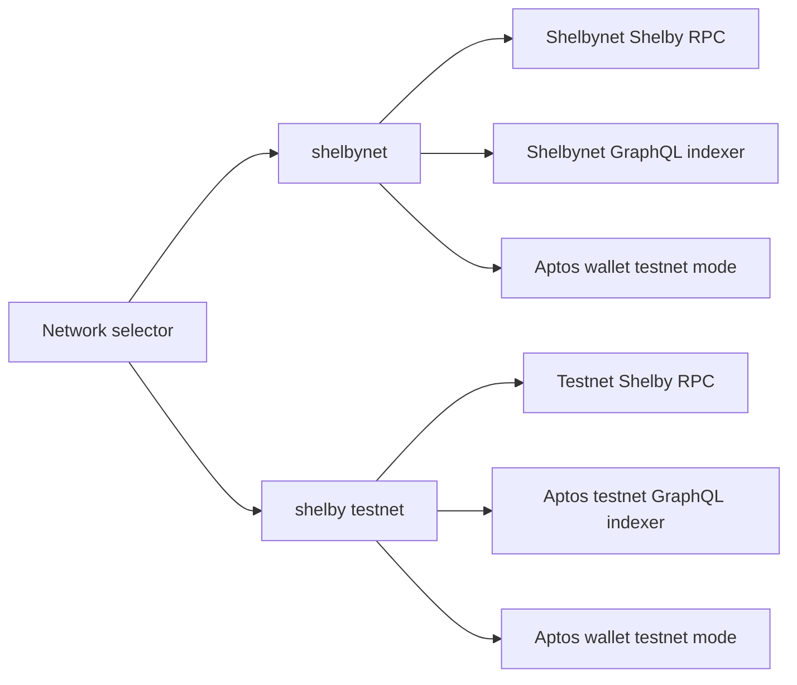
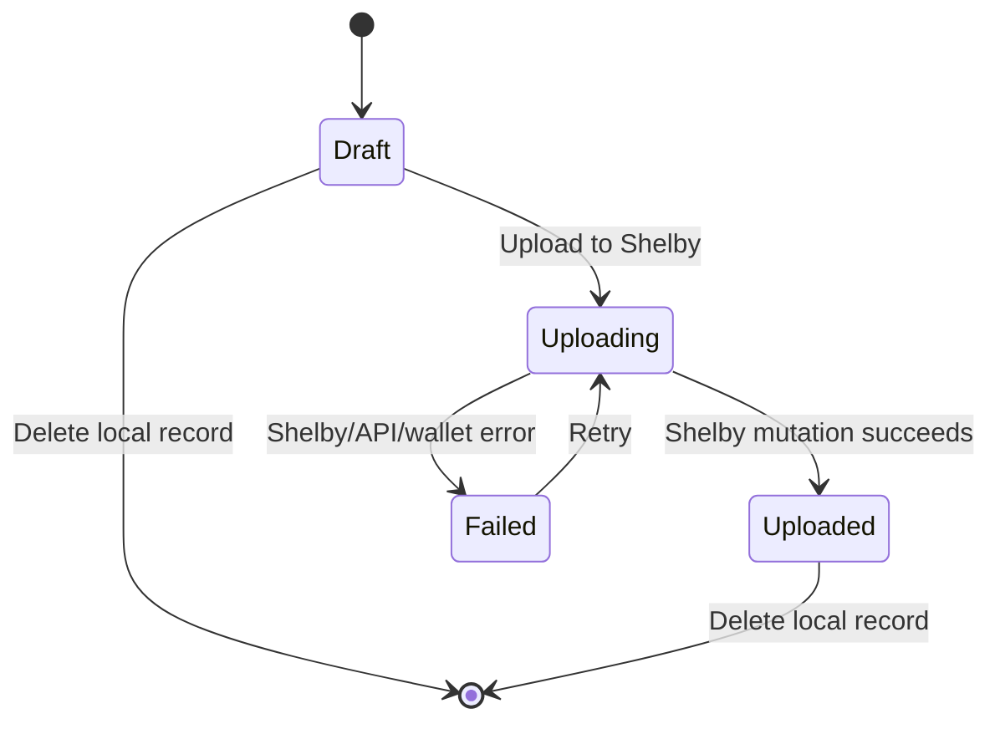
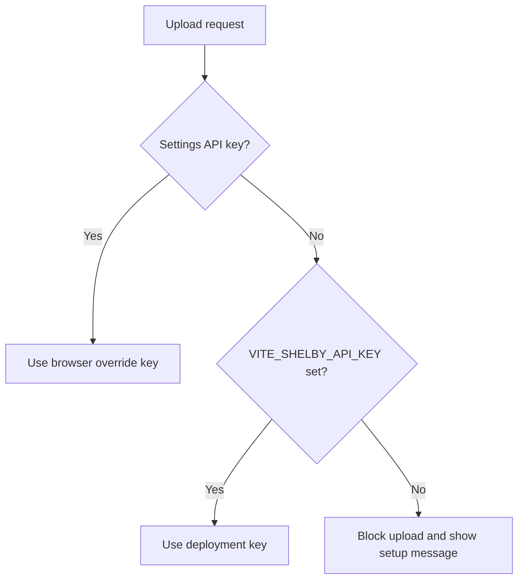
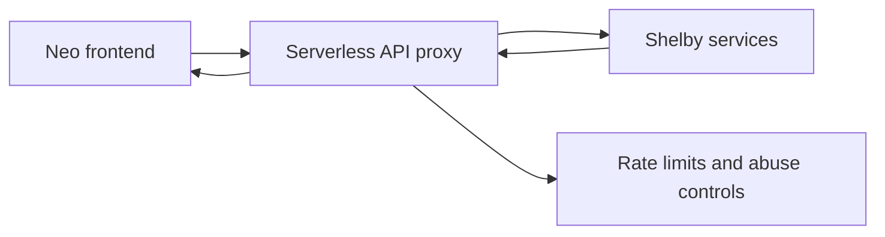

# Neo

Neo is a polished Shelby media vault dApp for creators, builders, and communities building on Aptos. It provides a focused workflow for preparing media, connecting an Aptos wallet, uploading blobs through Shelby, and previewing community share pages.

The project is designed as a high-end community MVP: real Shelby SDK integration, wallet-aware upload flows, local vault records, network switching, and a production-minded interface with light and dark themes.

## What Neo Does

- Connects to Aptos-compatible wallets through the Aptos Wallet Adapter.
- Supports `shelbynet` and `shelby testnet` network profiles.
- Uses the Shelby React SDK and Shelby TypeScript SDK for blob upload flows.
- Stores local vault metadata in the browser for demo and MVP workflows.
- Provides share-page previews for public, private, and token-gated media states.
- Ships with Aptos-inspired typography, a refined color system, and responsive UI.

## Product Flow



## System Architecture



## Upload Workflow



## Network Model



## Data Lifecycle



## Tech Stack

- React
- Vite
- TypeScript
- Aptos TypeScript SDK
- Aptos Wallet Adapter
- Shelby Protocol SDK
- Shelby React SDK
- TanStack Query

## Project Structure

```txt
.
├── public/
│   └── fonts/
│       ├── atkinson-hyperlegible-next-normal.woff2
│       └── atkinson-hyperlegible-next-italic.woff2
├── src/
│   ├── App.tsx
│   ├── config.ts
│   ├── providers.tsx
│   ├── shelby.ts
│   ├── storage.ts
│   ├── styles.css
│   └── types.ts
├── .env.example
├── index.html
├── package.json
└── vite.config.ts
```

## Requirements

- Node.js 20 or newer
- npm
- Aptos-compatible browser wallet
- Shelby or Aptos API key for real uploads

## Local Development

Install dependencies:

```bash
npm install
```

Create an environment file:

```bash
cp .env.example .env
```

Set the API key:

```env
VITE_SHELBY_API_KEY=your_shelby_or_aptos_api_key_here
```

Start the app:

```bash
npm run dev
```

Build the production bundle:

```bash
npm run build
```

Preview the production build:

```bash
npm run preview
```

## Configuration

Neo reads the API key in this order:

1. A user-provided key saved in Settings.
2. `VITE_SHELBY_API_KEY` from the deployment environment.

This makes it possible to deploy a community demo where users can upload without manually entering an API key.



## Upload Testing Checklist

1. Connect an Aptos wallet.
2. Select `shelbynet` or `shelby testnet`.
3. Confirm an API key is available through `.env`, deployment env, or Settings.
4. Upload a small file first.
5. Confirm the record appears in the Vault.
6. Open the Share preview.
7. Test the failed path by removing the key and confirming the UI shows a clear message.

Without a valid API key, Shelby will reject upload or indexer requests with `401 Unauthorized`.

## Deployment

For Vercel or another static host, set:

```env
VITE_SHELBY_API_KEY=your_shelby_or_aptos_api_key_here
```

Then deploy the app with the normal Vite build command:

```bash
npm run build
```

The production output is generated in `dist/`.

## Security Model

Neo is currently a frontend-only dApp. Any `VITE_` environment variable is compiled into the client bundle and can be inspected in the browser.

For a hardened public deployment, move protected Shelby API-key operations behind a serverless proxy or backend service.

Recommended production path:



## Current Status

Neo is ready as a polished Shelby community MVP and demo dApp.

Production hardening still recommended:

- Persistent metadata storage beyond `localStorage`.
- Real route handling for share URLs such as `/share/:slug`.
- Server-side API-key protection.
- Rate limiting for community deployments.
- Full end-to-end upload testing with real Shelby credentials.

## License

Add a license before publishing the repository publicly.
